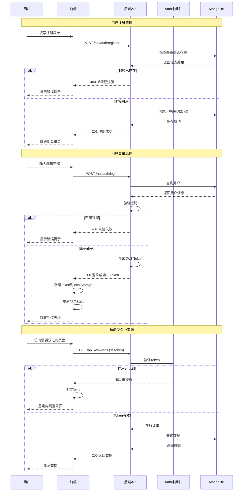
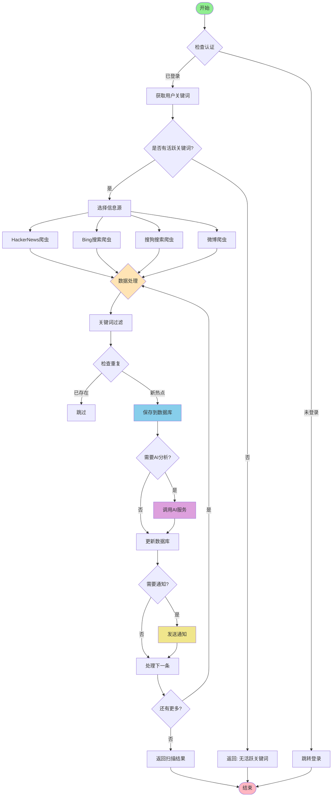
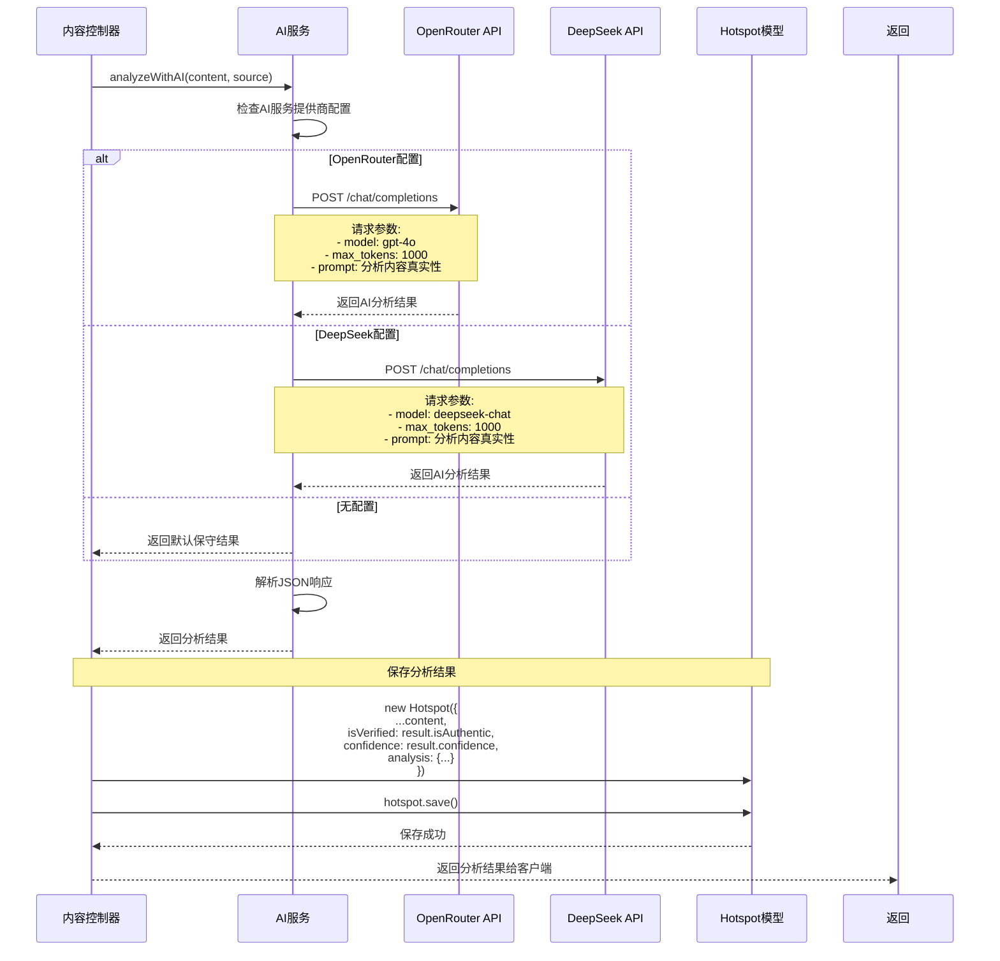
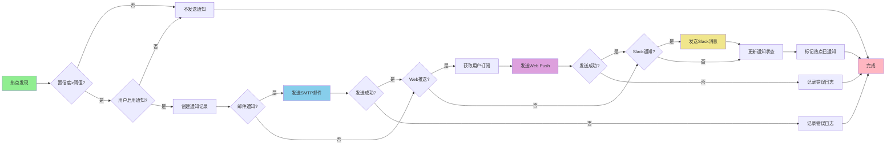
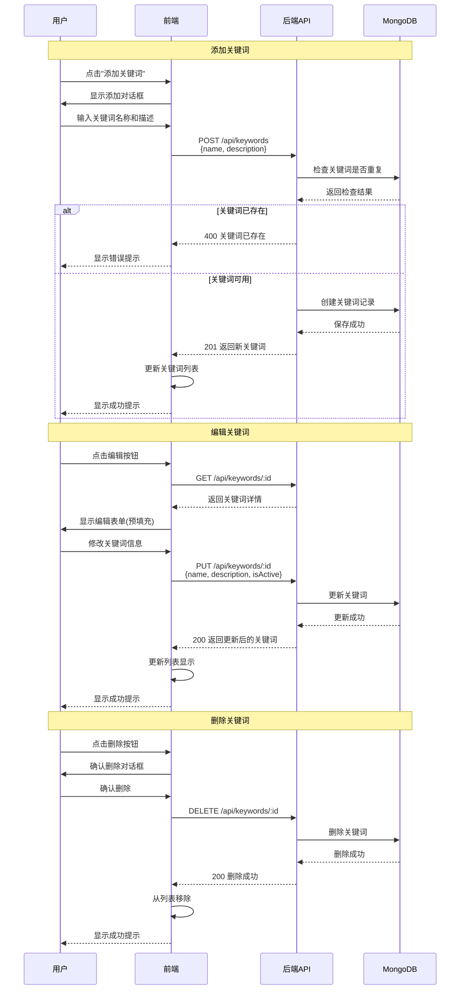
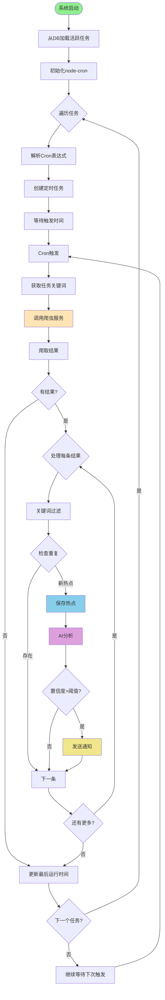

# 🔥 AI热点监控系统 - 项目架构文档

## 目录

- [1. 项目概述](#1-项目概述)
- [2. 整体架构思维导图](#2-整体架构思维导图)
- [3. 技术栈](#3-技术栈)
- [4. 项目结构](#4-项目结构)
- [5. 数据模型](#5-数据模型)
- [6. 业务流程图](#6-业务流程图)
  - [6.1 用户认证流程](#61-用户认证流程)
  - [6.2 热点扫描流程](#62-热点扫描流程)
  - [6.3 AI内容分析流程](#63-ai内容分析流程)
  - [6.4 通知发送流程](#64-通知发送流程)
  - [6.5 关键词管理流程](#65-关键词管理流程)
  - [6.6 定时任务调度流程](#66-定时任务调度流程)
- [7. API接口文档](#7-api接口文档)
- [8. 系统状态](#8-系统状态)

---

## 1. 项目概述

AI热点监控系统是一个智能化的热点发现和通知系统，主要服务于AI编程博主、科技媒体从业者等用户。系统能够7×24小时自动监控多个科技信息源，基于用户设定的关键词进行智能匹配，并通过AI进行内容真实性分析，最后通过多渠道通知用户。

### 核心功能模块

| 模块 | 功能描述 |
|------|----------|
| **用户管理** | 注册、登录、权限控制 |
| **关键词管理** | 添加、编辑、删除监控关键词 |
| **热点爬虫** | 多源数据抓取（HackerNews、Bing、搜狗、微博等）|
| **AI分析** | 内容真实性验证、可信度评分 |
| **通知服务** | 邮件、Web推送等多渠道通知 |
| **任务调度** | 定时扫描、手动触发 |
| **数据可视化** | 热点趋势、统计分析 |

---

## 2. 整体架构思维导图

```mermaid
graph TB
    subgraph "🔥 AI热点监控系统"
        subgraph "前端层 Frontend"
            A1[Dashboard 仪表板]
            A2[Keywords 关键词管理]
            A3[History 历史记录]
            A4[Notifications 通知中心]
            A5[Settings 系统设置]
            A6[Profile 个人中心]
            A7[Login/Register 认证]
        end

        subgraph "API网关层 API Gateway"
            B1[Auth Middleware 认证中间件]
            B2[CORS 跨域处理]
            B3[Helmet 安全防护]
            B4[Request Logger 请求日志]
        end

        subgraph "业务逻辑层 Backend Controllers"
            C1[User Controller 用户控制器]
            C2[Keyword Controller 关键词控制器]
            C3[Content Controller 内容控制器]
            C4[Task Controller 任务控制器]
            C5[Notification Controller 通知控制器]
            C6[Settings Controller 设置控制器]
        end

        subgraph "服务层 Services"
            D1[AI Service AI分析服务]
            D2[Crawler Service 爬虫服务]
            D3[Notification Service 通知服务]
            D4[Task Service 任务调度服务]
        end

        subgraph "数据访问层 Data Access"
            E1[User Model 用户模型]
            E2[Keyword Model 关键词模型]
            E3[Hotspot Model 热点模型]
            E4[Task Model 任务模型]
            E5[Notification Model 通知模型]
        end

        subgraph "数据存储层 Storage"
            F1[(MongoDB 数据库)]
        end

        subgraph "外部服务 External Services"
            G1[OpenRouter API]
            G2[DeepSeek API]
            G3[HackerNews API]
            G4[Bing Search]
            G5[搜狗搜索]
            G6[微博API]
            G7[SMTP邮件服务]
            G8[Web Push服务]
        end

        %% 前端到API网关
        A1 --> B1
        A2 --> B1
        A3 --> B1
        A4 --> B1
        A5 --> B1
        A6 --> B1
        A7 --> B2

        %% API网关到控制器
        B1 --> C1
        B1 --> C2
        B1 --> C3
        B1 --> C4
        B1 --> C5
        B1 --> C6

        %% 控制器到服务层
        C1 --> E1
        C2 --> E2
        C3 --> D2
        C3 --> D1
        C4 --> D4
        C5 --> E5
        C6 --> E1

        %% 服务层到外部服务
        D1 --> G1
        D1 --> G2
        D2 --> G3
        D2 --> G4
        D2 --> G5
        D2 --> G6
        D3 --> G7
        D3 --> G8
        D4 --> D2
        D4 --> D1

        %% 服务层到数据访问层
        D1 --> E3
        D2 --> E3
        D3 --> E5
        D4 --> E4
        D4 --> E2

        %% 数据访问层到存储
        E1 --> F1
        E2 --> F1
        E3 --> F1
        E4 --> F1
        E5 --> F1

        style A1 fill:#e1f5ff
        style A2 fill:#e1f5ff
        style A3 fill:#e1f5ff
        style A4 fill:#e1f5ff
        style A5 fill:#e1f5ff
        style A6 fill:#e1f5ff
        style A7 fill:#e1f5ff
        style F1 fill:#90EE90
```

---

## 3. 技术栈

### 后端技术栈

| 技术 | 版本 | 用途 |
|------|------|------|
| Node.js | 18+ | 运行环境 |
| Express.js | 4.x | Web框架 |
| MongoDB | 4.4+ | 数据库 |
| Mongoose | 7.x | ODM工具 |
| JWT | - | 认证授权 |
| bcryptjs | - | 密码加密 |
| node-cron | 3.x | 定时任务 |
| axios | 1.x | HTTP请求 |
| cheerio | 1.x | HTML解析 |
| nodemailer | 6.x | 邮件发送 |
| web-push | 3.x | Web推送 |

### 前端技术栈

| 技术 | 版本 | 用途 |
|------|------|------|
| React | 18.x | UI框架 |
| TypeScript | 5.x | 类型系统 |
| Ant Design | 5.x | UI组件库 |
| React Router | 6.x | 路由管理 |
| Axios | 1.x | HTTP客户端 |
| Recharts | 2.x | 数据图表 |

### AI服务

| 服务 | 模型 | 用途 |
|------|------|------|
| OpenRouter | GPT-4o | 内容分析 |
| DeepSeek | deepseek-chat | 备选AI服务 |

---

## 4. 项目结构

### 后端目录结构

```
backend/
├── src/
│   ├── config/
│   │   └── database.ts              # 数据库配置
│   ├── controllers/                 # 控制器层
│   │   ├── user.controller.js
│   │   ├── keyword.controller.js
│   │   ├── content.controller.js
│   │   ├── task.controller.js
│   │   ├── notification.controller.js
│   │   └── settings.controller.js
│   ├── middleware/                  # 中间件
│   │   └── auth.middleware.js       # JWT认证中间件
│   ├── models/                      # 数据模型
│   │   ├── User.js
│   │   ├── Keyword.js
│   │   ├── Hotspot.js
│   │   ├── Task.js
│   │   └── Notification.js
│   ├── routes/                      # 路由定义
│   │   ├── user.routes.js
│   │   ├── keyword.routes.js
│   │   ├── content.routes.js
│   │   ├── task.routes.js
│   │   ├── notification.routes.js
│   │   └── settings.routes.js
│   └── services/                    # 业务服务
│       ├── ai.service.js            # AI分析服务
│       ├── ai.service.ts            # AI分析服务(TypeScript)
│       ├── crawler.service.js       # 通用爬虫服务
│       ├── hackernews.crawler.js    # HackerNews爬虫
│       ├── bing.crawler.js          # Bing搜索爬虫
│       ├── sogou.crawler.js         # 搜狗搜索爬虫
│       ├── weibo.crawler.js         # 微博爬虫
│       ├── google.crawler.js        # Google搜索爬虫
│       ├── ddg.crawler.js           # DuckDuckGo爬虫
│       ├── twitter.crawler.js       # Twitter爬虫
│       ├── bilibili.crawler.js      # B站爬虫
│       ├── notification.service.js  # 通知服务
│       └── task.service.js          # 任务调度服务
├── .env                             # 环境变量配置
├── .env.example                     # 环境变量示例
├── server.js                        # 服务器入口
├── package.json                     # 依赖配置
└── seed.js                          # 数据库初始化脚本
```

### 前端目录结构

```
frontend/
├── src/
│   ├── pages/                       # 页面组件
│   │   ├── Dashboard.tsx            # 仪表板
│   │   ├── Login.tsx                # 登录页
│   │   ├── Register.tsx             # 注册页
│   │   ├── Keywords.tsx             # 关键词管理
│   │   ├── Notifications.tsx        # 通知中心
│   │   ├── History.tsx              # 历史记录
│   │   ├── Settings.tsx             # 系统设置
│   │   └── Profile.tsx              # 个人中心
│   ├── utils/
│   │   ├── apiClient.ts             # API客户端
│   │   └── axios.ts                 # Axios实例配置
│   ├── config/
│   │   └── api.ts                   # API端点配置
│   ├── App.tsx                      # 主应用组件
│   └── index.tsx                    # 应用入口
├── public/                          # 静态资源
└── package.json                     # 依赖配置
```

---

## 5. 数据模型

### User (用户模型)

```javascript
{
  _id: ObjectId,
  username: String,        // 用户名 (3-30字符)
  email: String,           // 邮箱 (唯一)
  password: String,        // 加密密码
  avatar: String,          // 头像URL
  role: String,            // 角色: 'user' | 'admin'
  isActive: Boolean,       // 是否激活
  lastLogin: Date,         // 最后登录时间
  createdAt: Date,
  updatedAt: Date
}
```

### Keyword (关键词模型)

```javascript
{
  _id: ObjectId,
  userId: ObjectId,        // 关联用户
  name: String,            // 关键词名称 (1-100字符)
  description: String,     // 描述 (可选)
  isActive: Boolean,       // 是否启用
  createdAt: Date,
  updatedAt: Date
}
```

### Hotspot (热点模型)

```javascript
{
  _id: ObjectId,
  userId: ObjectId,        // 关联用户
  title: String,           // 标题
  content: String,         // 内容摘要
  source: String,          // 来源 (HackerNews/Bing/搜狗等)
  url: String,             // 原文链接
  timestamp: Date,         // 发现时间
  isVerified: Boolean,     // AI验证结果
  confidence: Number,      // 可信度 (0-100)
  keywords: [String],      // 匹配的关键词
  analysis: {
    summary: String,       // AI摘要
    reasons: [String]      // 分析理由
  },
  isNotified: Boolean,     // 是否已通知
  metadata: {              // 额外元数据
    hnId: Number,          // HackerNews ID
    score: Number,         // 评分
    descendants: Number,   // 评论数
    author: String         // 作者
  },
  createdAt: Date,
  updatedAt: Date
}
```

### Task (任务模型)

```javascript
{
  _id: ObjectId,
  userId: ObjectId,        // 关联用户
  name: String,            // 任务名称
  description: String,     // 任务描述
  schedule: String,        // Cron表达式
  keywords: [String],      // 关联关键词
  isActive: Boolean,       // 是否激活
  lastRun: Date,           // 最后运行时间
  createdAt: Date,
  updatedAt: Date
}
```

### Notification (通知模型)

```javascript
{
  _id: ObjectId,
  userId: ObjectId,        // 关联用户
  title: String,           // 通知标题
  body: String,            // 通知内容
  type: String,            // 类型: 'email' | 'push' | 'system'
  isRead: Boolean,         // 是否已读
  hotspotId: ObjectId,     // 关联热点
  createdAt: Date,
  updatedAt: Date
}
```

---

## 6. 业务流程图

### 6.1 用户认证流程



### 6.2 热点扫描流程



### 6.3 AI内容分析流程



### 6.4 通知发送流程



### 6.5 关键词管理流程



### 6.6 定时任务调度流程



---

## 7. API接口文档

### 认证接口

| 方法 | 路径 | 描述 | 认证 |
|------|------|------|------|
| POST | `/api/auth/register` | 用户注册 | 否 |
| POST | `/api/auth/login` | 用户登录 | 否 |
| POST | `/api/auth/logout` | 用户登出 | 否 |
| GET | `/api/auth/me` | 获取当前用户 | 是 |

### 关键词接口

| 方法 | 路径 | 描述 | 认证 |
|------|------|------|------|
| GET | `/api/keywords` | 获取关键词列表 | 是 |
| POST | `/api/keywords` | 创建关键词 | 是 |
| GET | `/api/keywords/:id` | 获取单个关键词 | 是 |
| PUT | `/api/keywords/:id` | 更新关键词 | 是 |
| DELETE | `/api/keywords/:id` | 删除关键词 | 是 |

### 内容接口

| 方法 | 路径 | 描述 | 认证 |
|------|------|------|------|
| GET | `/api/content/hotspots` | 获取热点列表 | 是 |
| POST | `/api/content/analyze` | 分析内容真实性 | 是 |
| POST | `/api/content/scan` | 手动触发扫描 | 是 |

### 任务接口

| 方法 | 路径 | 描述 | 认证 |
|------|------|------|------|
| GET | `/api/tasks` | 获取任务列表 | 是 |
| POST | `/api/tasks` | 创建任务 | 是 |
| GET | `/api/tasks/:id` | 获取单个任务 | 是 |
| PUT | `/api/tasks/:id` | 更新任务 | 是 |
| DELETE | `/api/tasks/:id` | 删除任务 | 是 |
| POST | `/api/tasks/:id/trigger` | 手动触发任务 | 是 |
| POST | `/api/tasks/scan` | 手动扫描(多源) | 是 |
| GET | `/api/tasks/sources` | 获取可用信息源 | 是 |

### 通知接口

| 方法 | 路径 | 描述 | 认证 |
|------|------|------|------|
| GET | `/api/notifications` | 获取通知列表 | 是 |
| PUT | `/api/notifications/:id/read` | 标记通知已读 | 是 |
| PUT | `/api/notifications/mark-all-read` | 标记全部已读 | 是 |
| DELETE | `/api/notifications/:id` | 删除通知 | 是 |

### 设置接口

| 方法 | 路径 | 描述 | 认证 |
|------|------|------|------|
| GET | `/api/settings` | 获取用户设置 | 是 |
| PUT | `/api/settings` | 更新用户设置 | 是 |

### 健康检查

| 方法 | 路径 | 描述 | 认证 |
|------|------|------|------|
| GET | `/health` | 系统健康检查 | 否 |

---

## 8. 系统状态

### 当前运行环境

| 项目 | 值 |
|------|-----|
| 项目路径 | `D:\Claude code\ai-hotspot-monitor` |
| MongoDB端口 | 27017 |
| 后端API端口 | 5001 |
| 前端端口 | 3002 |

### 管理员账号

| 项目 | 值 |
|------|-----|
| 邮箱 | `admin@example.com` |
| 密码 | `admin123` |

### 环境变量配置

**backend/.env**:
```env
PORT=5001
MONGODB_URI=mongodb://localhost:27017/ai-hotspot-monitor
JWT_SECRET=your-secret-key-change-this-in-production

# AI服务配置
AI_SERVICE_PROVIDER=openrouter
OPENROUTER_API_KEY=your-openrouter-api-key-here
OPENROUTER_API_URL=https://openrouter.ai/api/v1/chat/completions
OPENROUTER_MODEL=openai/gpt-4o
OPENROUTER_REFERER=http://localhost:3000
OPENROUTER_TITLE=AI Hotspot Monitor

DEEPSEEK_API_KEY=your-deepseek-api-key-here
DEEPSEEK_API_URL=https://api.deepseek.com/v1/chat/completions
DEEPSEEK_MODEL=deepseek-chat
```

### 支持的信息源

| 信息源 | 类型 | 状态 |
|--------|------|------|
| HackerNews | 官方API | ✅ 已实现 |
| Bing搜索 | 爬虫 | ✅ 已实现 |
| 搜狗搜索 | 爬虫 | ✅ 已实现 |
| 微博 | 爬虫 | ✅ 已实现(需Cookie) |
| Google搜索 | 爬虫 | ✅ 已实现 |
| DuckDuckGo | 爬虫 | ✅ 已实现 |
| Twitter | 爬虫 | ✅ 已实现 |
| B站 | 爬虫 | ✅ 已实现 |

---

## 附录

### Cron表达式示例

| 表达式 | 描述 |
|--------|------|
| `*/5 * * * *` | 每5分钟 |
| `*/30 * * * *` | 每30分钟 |
| `0 * * * *` | 每小时 |
| `0 0 * * *` | 每天0点 |
| `0 9 * * 1-5` | 工作日早上9点 |

### 置信度等级

| 等级 | 范围 | 颜色 | 说明 |
|------|------|------|------|
| 高 | 90-100 | 绿色 | 高度可信 |
| 中 | 70-89 | 橙色 | 基本可信 |
| 低 | 0-69 | 红色 | 需要验证 |

---

**文档版本**: v1.0
**最后更新**: 2026-04-11
**维护者**: AI Hotspot Monitor Team
